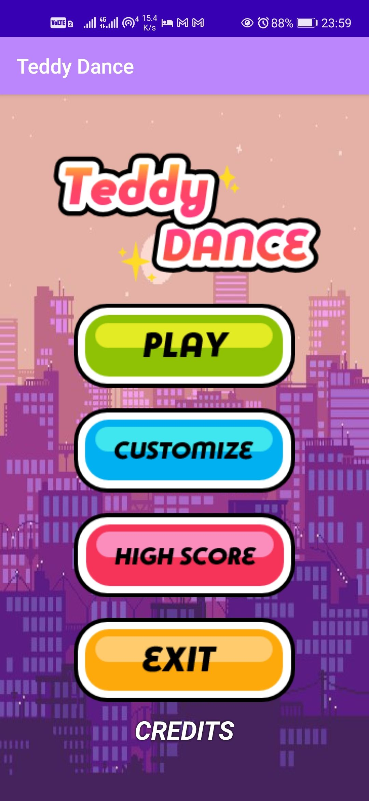

# TeddyDance

## My mobile application term project.

Android game developed using Java and Android Studio.

   

### How to play
1. Tap to start
2. Watch Teddy finish his dance moves
3. Copy the moves
4. **He dance more and more**
